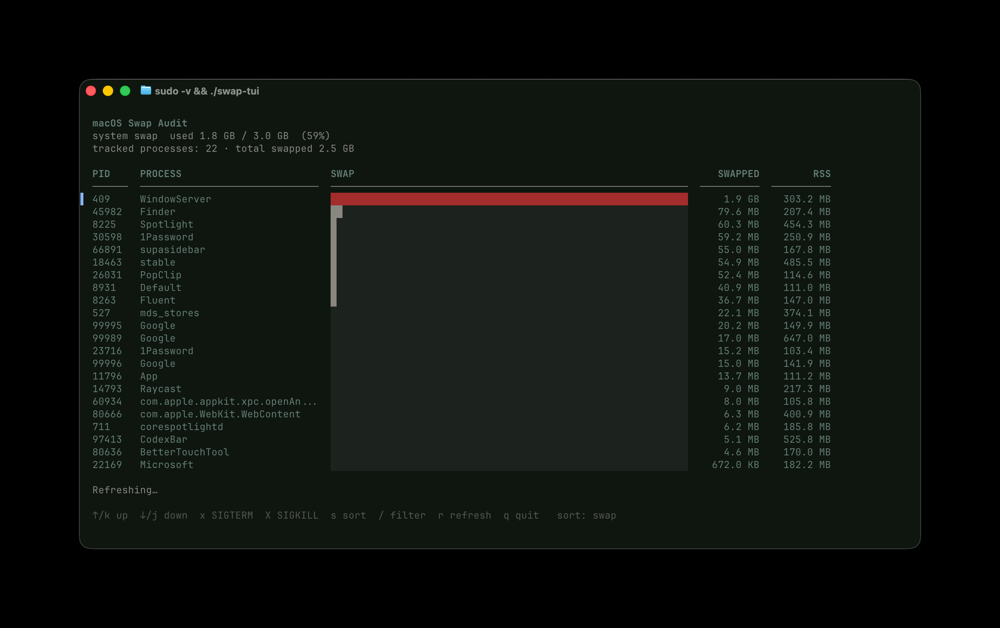

# swap-tui

A terminal UI for identifying which processes are contributing to swap on macOS.

macOS does not expose per-process swap usage through any standard tool. `swap-tui` works around this by running `vmmap --summary` concurrently against the top memory-consuming processes and parsing the `SWAPPED SIZE` column from each process's memory map summary. Results stream in as they arrive and refresh automatically every 30 seconds.



## Requirements

- macOS (uses `vmmap`, `ps`, `sysctl`)
- Go 1.21+
- `sudo` credentials for system-owned processes (optional — user-owned processes are scanned without it)

## Install

```bash
git clone https://github.com/robertotriunfo/swap-tui
cd swap-tui
go build -o swap-tui .
```

To stamp a version into the binary (otherwise it reports `dev`):

```bash
go build -ldflags "-X main.version=$(git describe --tags --always)" -o swap-tui .
```

Or run directly without installing:

```bash
go run .
```

## Usage

```bash
./swap-tui           # scan top 50 processes by RSS (default)
./swap-tui -n 75     # scan top 75 if you suspect processes outside the default range
./swap-tui -version  # print version and exit
```

For system processes (WindowServer, mds_stores, etc.) to appear, run with sudo credentials available:

```bash
sudo -v && ./swap-tui
```

### Key bindings

| Key | Action |
|---|---|
| `↑` / `k` | Move selection up |
| `↓` / `j` | Move selection down |
| `x` | Send SIGTERM to selected process |
| `X` | Send SIGKILL to selected process (force kill) |
| `s` | Toggle sort between swap and RSS |
| `/` | Filter the list by process name (Esc clears) |
| `r` | Force refresh now |
| `q` / `Ctrl+C` | Quit |

### Colour coding

| Colour | Meaning |
|---|---|
| Red | System process (cannot be quit safely) |
| Amber | User process with ≥ 100 MB swapped — worth quitting |
| Grey | User process with < 100 MB swapped |

## How it works

macOS memory management has two layers of pressure relief:

1. **Compression** — inactive pages are compressed and kept in RAM
2. **Swap** — if compressed RAM is also full, compressed pages are written to disk

`swap-tui` measures the second layer: actual disk-backed swap per process, via `vmmap --summary`. This is more precise than compressed memory (which is what Activity Monitor's "Swap Used" column shows) because it reflects pages that have actually been evicted to the swapfile.

The scan runs all `vmmap` calls in parallel. On a machine with 25 processes to check, the full scan completes in roughly the time of the slowest single `vmmap` call (~2–3 seconds).

## Running tests

```bash
# Unit tests (no external tools required)
go test ./...

# Include integration test (runs vmmap on the current process)
INTEGRATION=1 go test ./... -run TestScanCurrentProcess -v
```

## Project structure

```
main.go                    # entry point — creates and runs the bubbletea program
internal/
  process/
    types.go               # shared data types (Info, ScanResult, SwapStats)
    parser.go              # pure parsing: vmmap output and sysctl swap stats
    parser_test.go         # unit tests for all parsing logic
    scanner.go             # I/O: runs ps, vmmap, sysctl; manages concurrency
    scanner_test.go        # unit tests for ps parsing; integration test for vmmap
  ui/
    keys.go                # key binding definitions
    barchart.go            # pure rendering helpers: Row, Header, FormatBytes
    barchart_test.go       # unit tests for bar sizing, formatting, categories
    app.go                 # bubbletea Model, Init, Update — all state transitions
    app_test.go            # unit tests for navigation, kill flow, scan streaming
    view.go                # View() only — reads model, produces string, no mutation
```

The `process` package has no dependency on the `ui` package. The `parser.go` file has no I/O — all parsing functions take strings and return values, making them fast to test without shelling out.

## Caveats

- `vmmap` can be slow on processes with large virtual address spaces (1–3 seconds each). The parallel scan mitigates this but the first load takes a few seconds.
- Some system processes reject `vmmap` even with sudo. These are silently skipped.
- Swap numbers reflect a point-in-time snapshot. macOS moves pages between compressed RAM and swap continuously, so values change between refreshes.
